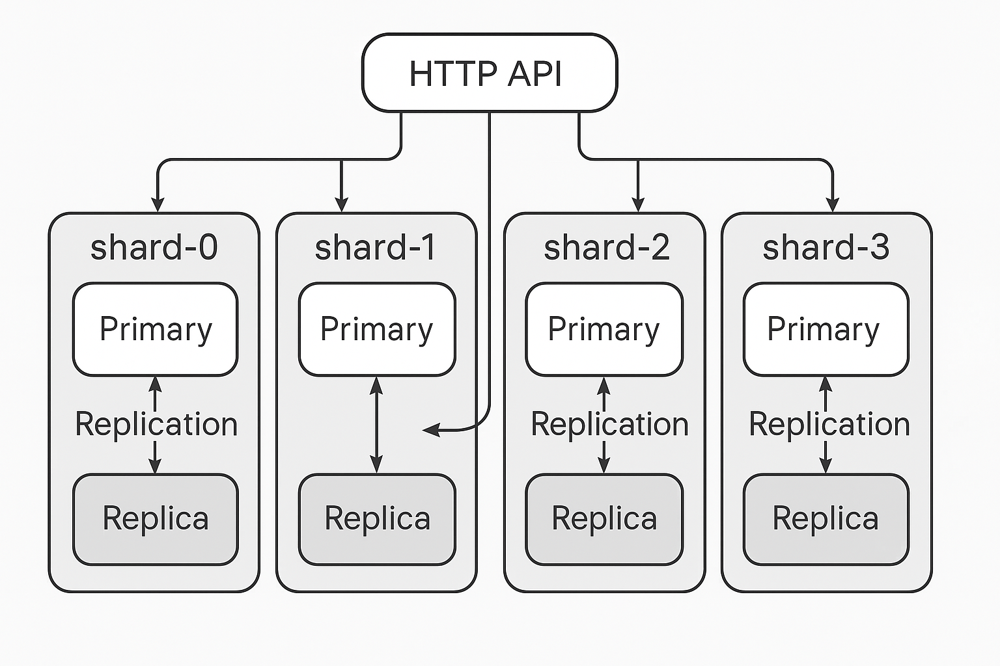

# A Distributed Key-Value Store in Go

**distribKV** is a distributed key-value store written in Go. It supports sharding, replication, client-side routing, LSM-based storage (BadgerDB), and more.

---

> [!NOTE]
> This project is for **educational purposes** — to understand how a **key-value store** works under the hood along with the theoretical concepts of **sharding, replication, LSM trees, consistency models**, **bloom filters**, and **distributed systems**.

## 📦 Features

- **Sharding & Replication** with configurable leaders and replicas
- **Client-side Routing** with HTTP redirection
- **LSM-Tree Storage** using BadgerDB
- **Benchmarking Tools** for performance testing
- **Concurrency** via Goroutines
- **Persistence** with Write-Ahead Logging and Compaction
- Built with Go 1.24 and designed for extensibility

---

## System Design & Architecture

This distributed key-value store is built with modern distributed systems principles, ensuring scalability, fault tolerance, and high availability.

### Distributed Systems Fundamentals

- **Sharding(static)**  
  The distribKV project utilizes a static sharding technique. In static sharding, the dataset is partitioned across predefined shards based on a fixed configuration. Each shard is responsible for a specific subset of the data, and the mapping between data keys and shards is established at the time of system configuration. In distribKV, this configuration is specified in the sharding.toml file.

- **Replication**  
  Maintains multiple copies (replicas) of data across nodes for fault tolerance and high availability. Uses a **leader–follower model or single leader replication**, where the leader node handles all writes and followers synchronize data.

---

### Consistency Models

- **Eventual Consistency**  
  After a write, data is eventually replicated to all nodes, ensuring convergence over time.

- **Leader-based Replication**  
  A single leader node handles all writes. Follower nodes replicate updates to maintain consistency.

---

### Client-side Routing & Redirection

- **Key-based Routing**  
  Clients use consistent hashing to determine the shard responsible for a key.

- **Redirection**  
  If a request hits the wrong shard or non-leader replica, it is redirected using HTTP `307` or `308` status codes to the correct node.

---

### Persistence and Storage

- **BadgerDB (LSM Tree) and SSTables**  
  Uses [BadgerDB](https://github.com/dgraph-io/badger), an embeddable key-value store inspired by RocksDB and LevelDB. It implements a **Log-Structured Merge Tree (LSM)** architecture for high write throughput and efficient storage management.

  - **LSM Tree**: Writes are first stored in memory (MemTable) and periodically flushed to disk as immutable **Sorted String Tables (SSTables)**.
  - **Write-Ahead Log (WAL)**: Ensures durability by logging changes before applying them.
  - **Compaction**: Periodically merges SSTables to optimize read performance and reclaim storage space.
  - **Bloom Filters**:[Bloom filters](https://brilliant.org/wiki/bloom-filter) are built for each SSTable to help quickly reject non-existent keys, avoiding unnecessary disk reads.
---

### Scaling Types

- **Horizontal Scaling (Scale-Out)**  
  The system supports adding more nodes (shards or replicas) to distribute the load. Keys are partitioned across shards using [consistent hashing](https://www.hellointerview.com/learn/system-design/deep-dives/consistent-hashing), allowing efficient horizontal growth.

- **Vertical Scaling (Scale-Up)**  
  Each node can independently handle increased load by using efficient concurrency with Goroutines and optimizing storage with BadgerDB’s low-overhead design.

- **Shard-Based Partitioning**  
  Data is divided across shards by hashing keys. Each shard can be independently scaled with its own replicas and leaders.

- **Replication-Based Scaling**  
  Read operations are offloaded to replicas, reducing the load on leader nodes and improving throughput.

---

### Concurrency & Benchmarking

- **Goroutines**  
  Efficient parallelism using lightweight Go goroutines for concurrent `GET`/`SET` requests.

- **Benchmarking**  
  Tools for measuring:
  - Throughput (requests/sec)
  - Latency (response times)
  - Load performance

---

### Fault Tolerance & Resilience

- **Replication**  
  Replicas allow the system to survive leader failures without data loss.

- **Data Synchronization**  
  Periodic syncing ensures eventual consistency between leader and replicas.

---

### CAP Theorem Trade-offs

> “You can only choose two: **Consistency**, **Availability**, **Partition Tolerance**.”

**distribKV** favors:

- ✅ **Availability**
- ✅ **Partition Tolerance**
- 🚫 **(Relaxed) Consistency**

Strong consistency can be added with protocols like Raft or Paxos in the future (LOL).

---
## References

This project draws inspiration from:
- [Go, for Distributed Systems by Russ Cox](https://go.dev/talks/2013/distsys.slide#1)
- [Designing Data-Intensive Applications by Martin Kleppmann](https://www.amazon.com/Designing-Data-Intensive-Applications-Reliable-Maintainable/dp/1449373321)
- [Patterns of Distributed Systems by Unmesh Joshi](https://martinfowler.com/books/patterns-distributed.html)
- [Distributed key-value database series on YouTube](https://www.youtube.com/playlist?list=PLWwSgbaBp9XrMkjEhmTIC37WX2JfwZp7I)
- [BadgerDB docs](https://docs.hypermode.com/badger/overview)
- [Go package for bloom filters](https://github.com/bits-and-blooms/bloom)
- [Arpit Bhayani short tutorials](https://www.youtube.com/@AsliEngineering)
- [Consistent Hashing](https://www.hellointerview.com/learn/system-design/deep-dives/consistent-hashing)

